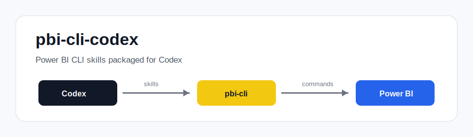
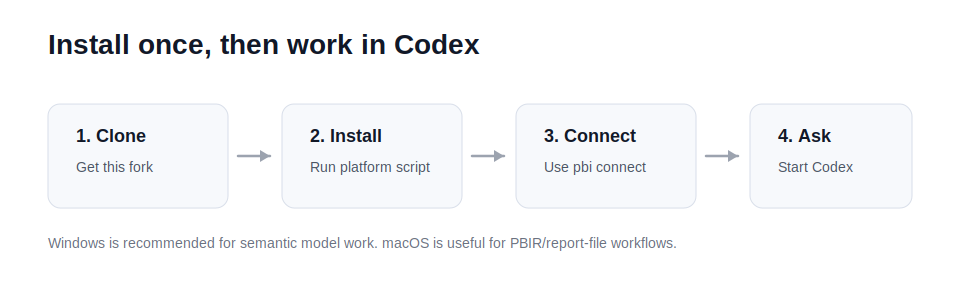

# pbi-cli-codex



This repository is a **Codex-focused adaptation of Mina Saad's original
[`MinaSaad1/pbi-cli`](https://github.com/MinaSaad1/pbi-cli)** project.

The original project provides the Power BI CLI, the Power BI Desktop interop
layer, PBIR report commands, and the first version of the Power BI agent skills.
This fork keeps that foundation and adds a cleaner Codex setup path:

- Codex-compatible `SKILL.md` frontmatter.
- `pbi-cli skills install --agent codex`.
- Installation into Codex's agent skill directory, `~/.agents/skills`.
- Global Codex guidance in `~/.codex/AGENTS.md`.
- Simple macOS and Windows installers.

This is not an official Microsoft or OpenAI project.

## Install For Codex

### Windows

Windows is the recommended environment for semantic model work because Power BI
Desktop runs on Windows.

```powershell
git clone https://github.com/Juanxchito/pbi-cli-codex.git
cd pbi-cli-codex
powershell -ExecutionPolicy Bypass -File .\scripts\codex\install-codex-windows.ps1
```

Then open Power BI Desktop with a `.pbix` file and run:

```powershell
pbi connect
```

Start a new Codex session after installing so Codex can load the new skills.

### macOS

macOS can install the Codex skills and use PBIR/report-file workflows. Direct
semantic model commands still require Power BI Desktop on Windows, a VM, or a
compatible remote host.

```bash
git clone https://github.com/Juanxchito/pbi-cli-codex.git
cd pbi-cli-codex
bash scripts/codex/install-codex-macos.sh
```

## Verify

```bash
pbi-cli skills list --agent codex
pbi --json setup --info
```

You should see 13 installed `power-bi-*` skills.

## What Codex Gets



After installation, Codex can discover these skills:

| Area | Skills |
| --- | --- |
| Semantic model | `power-bi-dax`, `power-bi-modeling`, `power-bi-deployment`, `power-bi-docs`, `power-bi-partitions`, `power-bi-security`, `power-bi-diagnostics` |
| PBIR report layer | `power-bi-report`, `power-bi-visuals`, `power-bi-pages`, `power-bi-themes`, `power-bi-filters`, `power-bi-custom-visuals` |

## Example Prompts

Semantic model examples, after `pbi connect`:

```text
Create a measure named Total Revenue on the Sales table.
Run a DAX query that returns the top 10 products by revenue.
Document the tables, columns, relationships, and measures in this model.
Set up row-level security for regional managers.
Export the semantic model to TMDL for version control.
```

PBIR report examples:

```text
Create a PBIR report project for executive sales reporting.
Add an overview page with a bar chart for revenue by region.
Apply a page filter for the last 30 days.
Create a simple corporate theme using our brand colors.
Validate the report structure before I open it in Power BI Desktop.
```

## Claude Code Compatibility

The original Claude Code path is still present:

```bash
pbi-cli skills install
```

For Codex, use:

```bash
pbi-cli skills install --agent codex
```

## Attribution

This repository is derived from:

```text
https://github.com/MinaSaad1/pbi-cli
```

Credit for the core CLI design, Power BI Desktop interop, PBIR command set, and
original bundled skills belongs to Mina Saad and the pbi-cli contributors. This
repository exists to make that work easier to install and use from Codex.

The upstream project is MIT licensed. See [LICENSE](LICENSE), [NOTICE](NOTICE),
and [THIRD_PARTY_LICENSES.md](THIRD_PARTY_LICENSES.md) for license details,
including the Microsoft Analysis Services client library notices.

## Development

```bash
python -m venv .venv
. .venv/bin/activate
pip install -e ".[dev]"
pytest -m "not e2e"
```

Useful focused checks for this fork:

```bash
pytest tests/test_codex_agents_md.py tests/test_skills_cmd.py tests/test_claude_md.py
ruff check src/pbi_cli/commands/skills_cmd.py src/pbi_cli/core/codex_integration.py tests/test_codex_agents_md.py tests/test_skills_cmd.py
```
